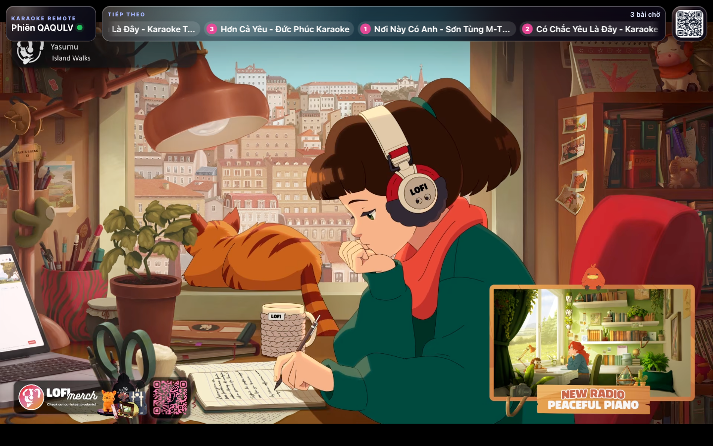
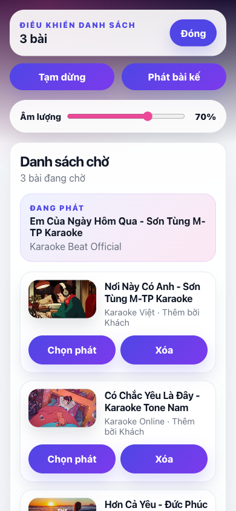
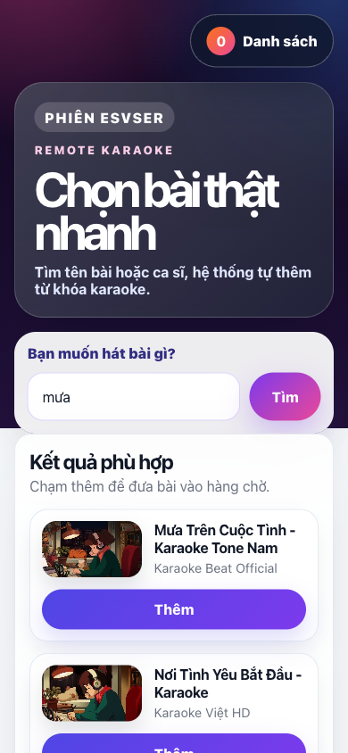
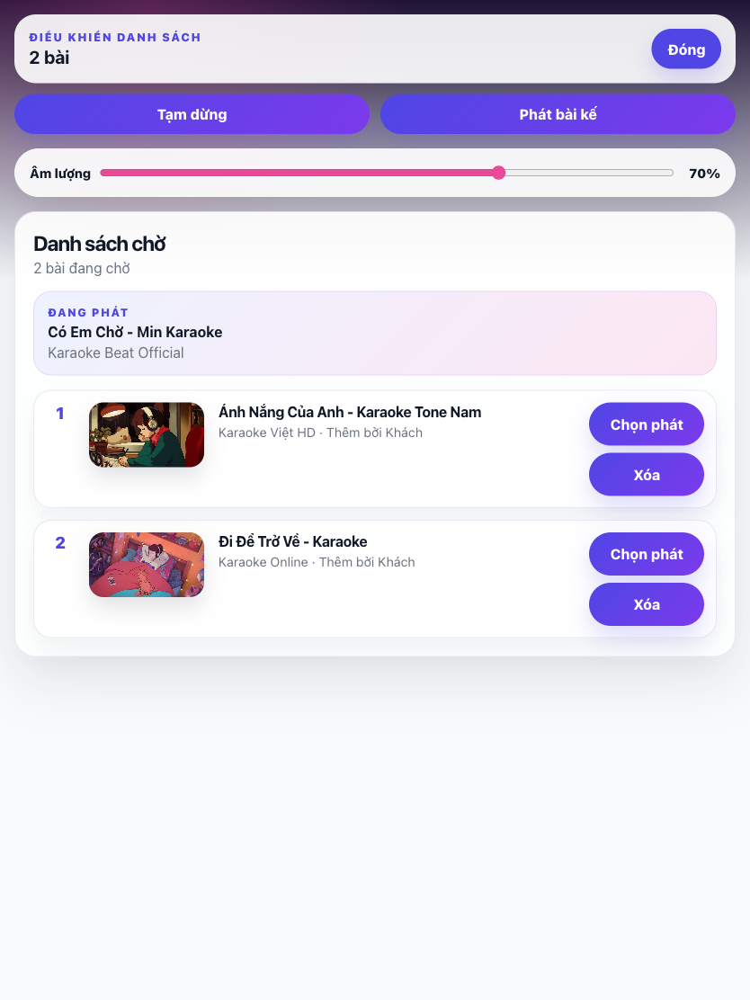

# Karaoke Remote

English | [Tiếng Việt](README.vi.md)

A local-first karaoke web app for house parties: one fullscreen host player on the computer, and mobile remotes for guests to scan, search, queue, and control songs in realtime.

## Showcase

### Host

<table>
  <tr>
    <th>Fullscreen player</th>
  </tr>
  <tr>
    <td></td>
  </tr>
</table>

### Guest

<table>
  <tr>
    <th>Playlist controls</th>
    <th>Search screen</th>
    <th>Tablet responsive</th>
  </tr>
  <tr>
    <td></td>
    <td></td>
    <td></td>
  </tr>
</table>

## Why it exists

Karaoke Remote turns a laptop or TV into the shared player while everyone else uses their phone as the remote. The host starts a local session, guests join from a QR code, and the queue stays synced over WebSockets.

## Highlights

- Fullscreen-style YouTube host player with overlay controls.
- QR join flow for phones and tablets on the same network.
- Mobile-first guest remote for search, queueing, playback, skip, select, and remove.
- Realtime session sync with WebSockets.
- Backend YouTube search proxy using the official YouTube Data API.
- Vietnamese UI by default.

## Tech stack

| Area | Tools |
| --- | --- |
| Frontend | React, Vite, TypeScript |
| Backend | Express, TypeScript |
| Realtime | `ws` WebSocket server |
| Karaoke source | YouTube IFrame Player API, YouTube Data API |
| QR codes | `qrcode` |

## Requirements

- Node.js 20+
- npm
- A YouTube Data API key

## Quick start

```sh
npm install
cp .env.example .env
```

Edit `.env`:

```env
PORT=3001
APP_PUBLIC_ORIGIN=http://localhost:5173
YOUTUBE_API_KEY=your_youtube_api_key
```

Start the app:

```sh
make dev
```

Open the host player at `http://localhost:5173`.

## Phone access

Phones cannot use `localhost` to reach the host computer. For guests on the same Wi-Fi, set `APP_PUBLIC_ORIGIN` to the host computer's LAN IP:

```env
APP_PUBLIC_ORIGIN=http://192.168.x.x:5173
```

The Vite dev server binds to `0.0.0.0`, so LAN devices can connect when the OS firewall allows inbound traffic.

## How to use

1. Open `http://localhost:5173` on the host computer.
2. The host creates a session and shows a QR button in the top-right overlay.
3. Guests scan the QR code or open the join URL on their phones.
4. Guests search by song or artist; the app automatically appends `karaoke` when needed.
5. Guests add songs to the queue.
6. The host overlay and guest playlist drawer can play, pause, skip, select, or remove songs.

## Commands

| Command | Description |
| --- | --- |
| `make install` | Install dependencies with npm. |
| `make dev` | Run frontend and backend together. |
| `make dev-fe` | Run only the Vite frontend. |
| `make dev-be` | Run only the Express/WebSocket backend. |
| `make down` | Stop frontend and backend dev ports. |
| `make build` | Typecheck and build the client and server. |
| `make start` | Start the built production server. |
| `make clean` | Remove build output. |

Default local ports:

- Frontend: `http://localhost:5173`
- Backend/API/WebSocket: `http://localhost:3001`

## Production build

```sh
make build
make start
```

Production serves the Vite client from `dist/client` and the API/WebSocket server from the same Express app.

## Project structure

```txt
client/src/
  api/             REST API clients
  components/      shared React UI
  hooks/           WebSocket session hook
  pages/           host and guest pages
  types/           client session/message types
  styles.css       app styling

server/src/
  config/          environment loading
  routes/          REST API routes
  services/        session store and YouTube API access
  types/           server session types
  ws/              WebSocket message handling
```

## Verification

Before committing changes, run:

```sh
npm run build
```

For UI changes, also run the app and verify in a browser:

- Host page creates a session and shows a connected status dot.
- QR panel opens and the join URL matches `APP_PUBLIC_ORIGIN`.
- Guest page works in a mobile viewport.
- Search returns results and appends `karaoke`.
- Adding songs updates both guest queue and host overlay.
- Play/pause/next/select/remove sync across host and guest.

## Environment notes

- `.env` is local-only and ignored by git.
- `.env.example` documents required variables without secrets.
- `YOUTUBE_API_KEY` stays server-side.
